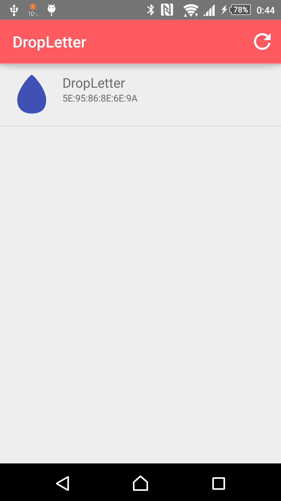
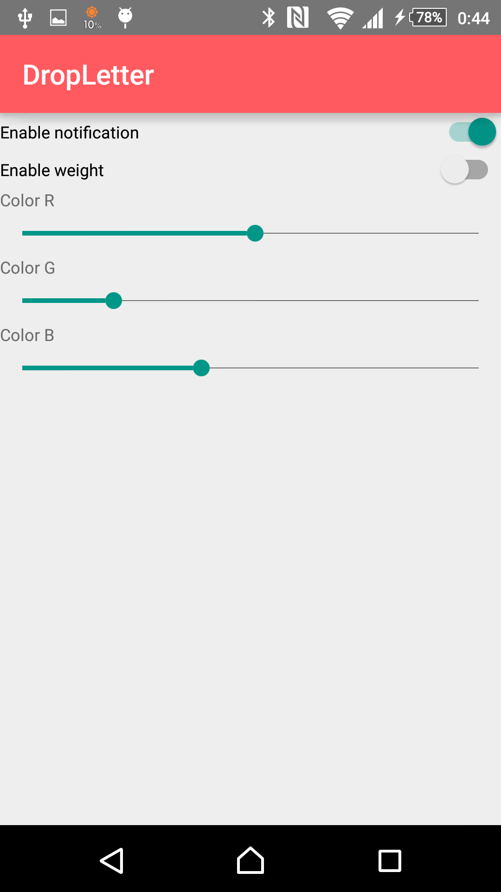

DropLetter
====

DropLetter is a neckless style notification device.

We can get notification like a drop of water.

## Hardware
* RedBearLab BLE Nano
* Moment control system
* Vibration motor
* Full color LED

### Data Structure
#### GATT Profiles
  <table>
   <tr><th>Service</th><th>Characteristics</th><th>Type</th><th>Range</th><th>UUID</th></tr>
   <tr><th>Default</th><td></td><td></td><td></td><td>6E400001-B5A3-F393-E0A9-E50E24DCCA9E</td></tr>
   <tr><th></th><td>TX</td><td>String</td><td></td><td>6E400002-B5A3-F393-E0A9-E50E24DCCA9E </td></tr>
   <tr><th></th><td>RX</td><td>String</td><td></td><td>6E400003-B5A3-F393-E0A9-E50E24DCCA9E </td></tr>
   <tr><th>DropLetter</th><td></td><td></td><td></td><td></td></tr>
   <tr><th></th><td>Vibration</td><td>int</td><td>0-255</td><td></td></tr>
   <tr><th></th><td>Weight</td><td>int</td><td>0-255</td><td></td></tr>
   <tr><th></th><td>LED</td><td>int</td><td>0-255</td><td></td></tr>
  </table>

## Software
### Overview
* MainActivity
  - This activity contains fragment container.
  - BleService and NotificationService are controlled by this activity over RPC.
* BleService
  - This service controls DropLetter over Bluetooth Low Energy.
* NotificationService
  - This service handling notification which comes from other applications.

#### SQL Schema
Database name: DropLetter

<table>
   <tr><th>Informant</th><th></th><th></th></tr>
   <tr><td>Id</td><td>Integer</td><td>Autoincrement</td></tr>
   <tr><td>PackageName</td><td>varchar(1014)</td><td></td></tr>
   <tr><td>Count</td><td>Interger</td><td></td></tr>
   <tr><td>Importance</td><td>Integer</td><td></td></tr>
</table>

### Requirement
* Android 5.0 Lollipop (or higher)
* Bluetooth Low Energy

### Screenshots

## License
MIT License

## Author

[yuki-tkd](https://github.com/yuki-tkd)
